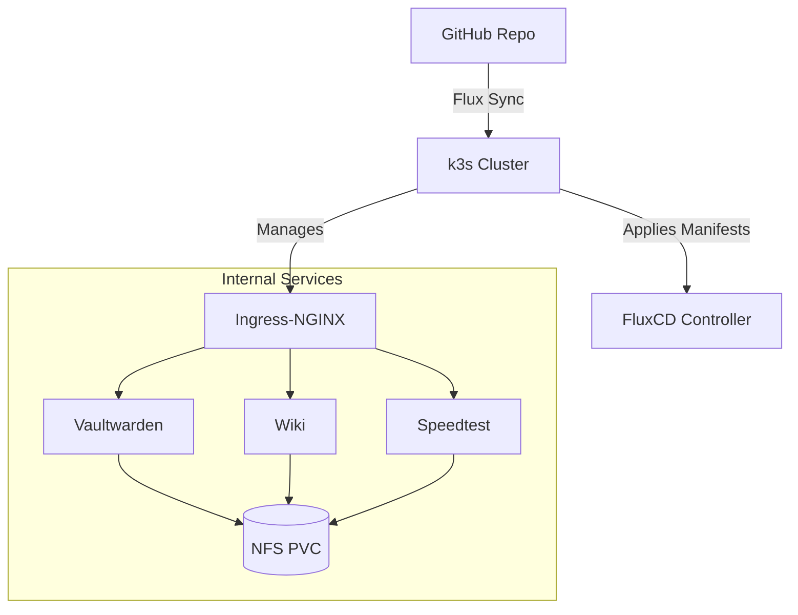

# HomeLab Kubernetes GitOps Setup

Welcome to my Homelab GitOps repository! This project defines a self-hosted infrastructure stack using Kubernetes, Flux, and secure GitOps practices. The entire system runs on bare-metal nodes at home with persistent storage, service monitoring, and secret encryption.

---

## Core Technologies

- [**Kubernetes (k3s)**](https://github.com/k3s-io/k3s) – Lightweight Kubernetes distribution for edge computing  
- [**FluxCD**](https://github.com/fluxcd/flux2) – GitOps controller to manage Kubernetes state from this repo  
- [**Kustomize**](https://github.com/kubernetes-sigs/kustomize) – Kubernetes-native configuration management  
- [**SOPS**](https://github.com/getsops/sops) + [**Age**](https://github.com/FiloSottile/age) – Encrypted Kubernetes Secrets with Git-safe commits  
- [**Traefik**](https://github.com/traefik/traefik) / [**Ingress-NGINX**](https://github.com/kubernetes/ingress-nginx) – Ingress controllers with TLS termination  
- [**cert-manager**](https://github.com/cert-manager/cert-manager) – Automated certificate management using Let's Encrypt  
- [**Prometheus**](https://github.com/prometheus/prometheus) – Time-series monitoring and alerting  
- [**Grafana**](https://github.com/grafana/grafana) – Dashboard visualization and metrics frontend  
- **Persistent Storage** – Backed by local NFS or ZFS with PVCs  
- [**CrowdSec**](https://github.com/crowdsecurity/crowdsec) – Security automation and protection (under active deployment)  

---

## Repository Structure

```text
.
├── apps/                   # Namespace-scoped applications
│   ├── vaultwarden/        # Encrypted password manager
│   ├── speedtest/          # Internet speed monitoring
│   └── wiki/               # Self-hosted Wiki + Postgres backend
├── infrastructure/         # Cluster-wide tools (monitoring, ingress, certs)
│   ├── blackbox/           # Blackbox Exporter monitoring probes
│   ├── crowdsec/           # CrowdSec LAPI and dashboards
│   └── cert-manager/       # Certificate automation
├── .gitlab-ci.yml          # YAML/manifest validation pipeline
├── README.md               # This file
└── LICENSE

```

## Secrets Management
All sensitive credentials are managed with SOPS and Age. Encrypted files are committed to Git and decrypted at runtime in-cluster via Flux + KSOPS.

Example of encrypting a secret:

```bash
sops --encrypt --age <YOUR_AGE_PUBLIC_KEY> --in-place ./secrets/secret.yaml
Decryption is only possible in-cluster with the correct private Age key stored securely.
```

## Deployment Flow
Create the GitOps repository (this repo).

- Bootstrap Flux with your Git credentials and public Age key:

```bash
flux bootstrap github \
  --owner=<your-github-user> \
  --repository=HomeLab \
  --path=./ \
  --personal \
  --private=false
```

- Apply secrets and allow SOPS to decrypt them via KSOPS or controller configuration.
- Flux continuously syncs all resources from Git.

## Monitoring and Observability

- Blackbox Exporter to probe endpoints like external IPs, DNS, or self-hosted services.
- Prometheus to track metrics.
- Alerts and dashboards are set up using Alertmanager and Grafana for visual dashboards.

## Network Layout (High-Level)


## CI/CD

- This repository includes a GitLab CI pipeline to validate manifests:
- yamllint checks formatting
- kustomize build ensures Kustomizations are valid

```yaml
before_script:
  - curl -Lo /usr/local/bin/kustomize ...
script:
  - find . -name "*.yaml" | xargs yamllint
  - kustomize build clusters/heimdall > /dev/null
```

## License
This project is licensed under the MIT License. See [LICENSE](./LICENSE) for details.